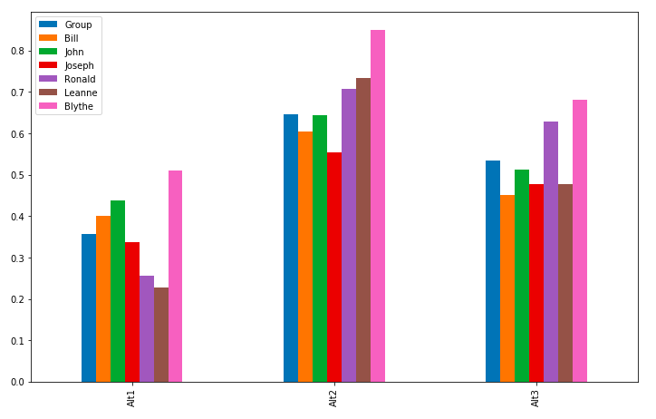

# AHP Trees
An AHP Tree, or *Simple AHP Hierarchy* is a tree of criteria, with alternatives at the bottom.  An example
looks like:


In `pyanp` we work on such structures with the `pyanp.ahptree` module.

## AHP Tree usage in pyanp
In this tutorial we will:

1. Show you how to import the AHPTree class (which is what handles all AHP tree calculations)
1. Read in a full AHP tree's data from a single excel spreadsheet
1. Show some standard calculations and their results
1. Resources for this tutorial

## 1. Importing the AHPTree class
And a few other classes you will need for later parts of this tutorial

```python
# Pandas has DataFrames and Series, very useful things
import pandas as pd
# numpy has lots of useful things in it
import numpy as np
# lastly import our ahptree python code.  If you haven't already installed the pyanp library do
# pip install pyanp
# to get it
from pyanp import ahptree
```

## 2. Loading data from an excel file

```python
excel_file = 'PATH_TO_YOUR_EXCEL_FILE'
ahp = ahptree.ahptree_fromdf(excel_file)
```

## 3. Some standard AHP calculations

### 3.1 The global priorities for all users and the overall
```python
gs = ahp.global_priority_table()
gs
```
<table border="1" class="dataframe">  <thead>    <tr style="text-align: right;">      <th></th>      <th>Group</th>      <th>Bill</th>      <th>John</th>      <th>Joseph</th>      <th>Ronald</th>      <th>Leanne</th>      <th>Blythe</th>    </tr>  </thead>  <tbody>    <tr>      <th>Goal</th>      <td>1.000000</td>      <td>1.000000</td>      <td>1.000000</td>      <td>1.000000</td>      <td>1.000000</td>      <td>1.000000</td>      <td>1.000000</td>    </tr>    <tr>      <th>A</th>      <td>0.241823</td>      <td>0.191670</td>      <td>0.357156</td>      <td>0.167712</td>      <td>0.064374</td>      <td>0.073360</td>      <td>0.714286</td>    </tr>    <tr>      <th>A1</th>      <td>0.061971</td>      <td>0.011303</td>      <td>0.142862</td>      <td>0.041904</td>      <td>0.008701</td>      <td>0.008887</td>      <td>0.405327</td>    </tr>    <tr>      <th>A2</th>      <td>0.078277</td>      <td>0.037579</td>      <td>0.142862</td>      <td>0.015989</td>      <td>0.032055</td>      <td>0.058384</td>      <td>0.053618</td>    </tr>    <tr>      <th>A3</th>      <td>0.101575</td>      <td>0.142788</td>      <td>0.071431</td>      <td>0.109819</td>      <td>0.023618</td>      <td>0.006088</td>      <td>0.255340</td>    </tr>    <tr>      <th>B</th>      <td>0.321400</td>      <td>0.054852</td>      <td>0.234003</td>      <td>0.235756</td>      <td>0.679480</td>      <td>0.726685</td>      <td>0.142857</td>    </tr>    <tr>      <th>B1</th>      <td>0.154726</td>      <td>0.009142</td>      <td>0.033429</td>      <td>0.039293</td>      <td>0.509610</td>      <td>0.645942</td>      <td>0.114286</td>    </tr>    <tr>      <th>B2</th>      <td>0.166674</td>      <td>0.045710</td>      <td>0.200574</td>      <td>0.196463</td>      <td>0.169870</td>      <td>0.080743</td>      <td>0.028571</td>    </tr>    <tr>      <th>C</th>      <td>0.436777</td>      <td>0.753478</td>      <td>0.408841</td>      <td>0.596533</td>      <td>0.256146</td>      <td>0.199955</td>      <td>0.142857</td>    </tr>    <tr>      <th>C1</th>      <td>0.116491</td>      <td>0.251159</td>      <td>0.045427</td>      <td>0.074567</td>      <td>0.224128</td>      <td>0.019996</td>      <td>0.035714</td>    </tr>    <tr>      <th>C2</th>      <td>0.320286</td>      <td>0.502318</td>      <td>0.363414</td>      <td>0.521966</td>      <td>0.032018</td>      <td>0.179960</td>      <td>0.107143</td>    </tr>  </tbody></table>

### 3.2 Let's graph the global priorities
```python
gs = ahp.global_priority_table()
gs.plot(kind="bar")
```


### 3.3 Now let's get the synthesized alternative scores
```python
altscores = ahp.priority_table()
altscores
```
<table border="1" class="dataframe">  <thead>    <tr style="text-align: right;">      <th></th>      <th>Group</th>      <th>Bill</th>      <th>John</th>      <th>Joseph</th>      <th>Ronald</th>      <th>Leanne</th>      <th>Blythe</th>    </tr>  </thead>  <tbody>    <tr>      <th>Alt1</th>      <td>0.356952</td>      <td>0.400781</td>      <td>0.438441</td>      <td>0.337148</td>      <td>0.256614</td>      <td>0.226740</td>      <td>0.509450</td>    </tr>    <tr>      <th>Alt2</th>      <td>0.645187</td>      <td>0.604409</td>      <td>0.644722</td>      <td>0.554433</td>      <td>0.707354</td>      <td>0.733468</td>      <td>0.851045</td>    </tr>    <tr>      <th>Alt3</th>      <td>0.533711</td>      <td>0.450100</td>      <td>0.512404</td>      <td>0.477552</td>      <td>0.629131</td>      <td>0.476311</td>      <td>0.681823</td>    </tr>  </tbody></table>

### 3.4 Let's graph the synthesized alternative scores
```python
altscores = ahp.priority_table()
altscores.plot(kind="bar")
```


### 3.5 Inconsistencies for all users and the group
```python
allincons = ahp.incond_std_table()
allincons
```
<table border="1" class="dataframe">  <thead>    <tr style="text-align: right;">      <th></th>      <th>Group</th>      <th>Bill</th>      <th>John</th>      <th>Joseph</th>      <th>Ronald</th>      <th>Leanne</th>      <th>Blythe</th>    </tr>  </thead>  <tbody>    <tr>      <th>Goal</th>      <td>0.056856</td>      <td>6.982872e-01</td>      <td>2.689665</td>      <td>1.767344e+00</td>      <td>0.164491</td>      <td>0.008849</td>      <td>-8.540177e-16</td>    </tr>    <tr>      <th>A</th>      <td>0.239585</td>      <td>5.580869e-01</td>      <td>0.480769</td>      <td>7.068608e-02</td>      <td>0.090399</td>      <td>0.096090</td>      <td>4.028993e-01</td>    </tr>    <tr>      <th>B</th>      <td>0.000000</td>      <td>4.440892e-16</td>      <td>0.000000</td>      <td>4.440892e-16</td>      <td>0.000000</td>      <td>0.000000</td>      <td>0.000000e+00</td>    </tr>    <tr>      <th>C</th>      <td>0.000000</td>      <td>0.000000e+00</td>      <td>0.000000</td>      <td>0.000000e+00</td>      <td>0.000000</td>      <td>0.000000</td>      <td>0.000000e+00</td>    </tr>  </tbody></table>

## 4. Resources for this tutorial

* [Jupyter Notebook for this tutorial](../examples/AHPTreeEx1.ipynb)
* [Excel file used](../tests/data/AHPTreeData.xlsx)
