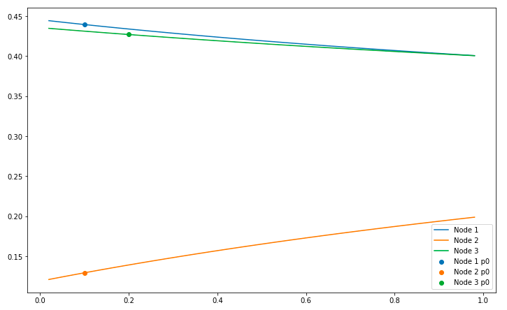
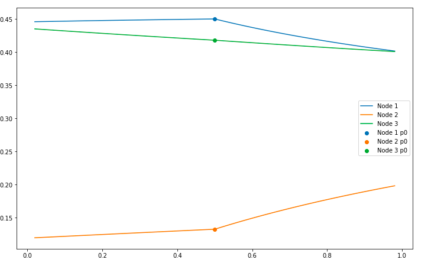

# ANP row sensitivity tutorial

In this tutorial we will learn how to:

1. Load the necessary libraries
2. Read in super matrices from csv/excel files
3. Directly input super matrices
4. Standard calculations
5. Row sensitivvity (aka influence) graphs
6. Find the programmers reference for all row sensitivity functions
7. Find the resources used in this tutorial

# 1. Load the necessary libraries
The library you need is `pyanp.rowsens`, but we will also make use of `numpy` and `pandas` so we will import those as well.

```python
# Pandas has DataFrames and Series, very useful things
import pandas as pd
# numpy has lots of useful things in it
import numpy as np
# lastly import our ahptree python code.  If you haven't already installed the pyanp library do
# pip install pyanp
# to get it
from pyanp import priority
```


# 2. Read in super matrices from csv/excel files

```python
# CSV/sheet sheet with no headers, handle this way
mat4 = rowsens.get_matrix("supermatrix1.csv")
# CSV/sheet with headers is the handled the same way
mat4 = rowsens.get_matrix("supermatrix4x4-headers.csv")
```

# 3. Directly input super matrices
We can also directly input the supermatrix as
```python
mat4 = np.array([[0.5 , 0.1 , 0.  , 0.  ],
       [0.2 , 0.6 , 0.  , 0.  ],
       [0.1 , 0.05, 0.75, 0.1 ],
       [0.2 , 0.25, 0.25, 0.9 ]])
```

# 4. Standard calculations
## 4.1 Calculate row adjust matrix
```python
rowsens.row_adjust(mat=mat4, row=0, p=0.1, p0mode=0.5)
```
the result is:
```
array([[0.1   , 0.02  , 0.    , 0.    ],
       [0.36  , 0.6533, 0.    , 0.    ],
       [0.18  , 0.0544, 0.75  , 0.1   ],
       [0.36  , 0.2722, 0.25  , 0.9   ]])
```
To use the smartp0, pass parameter p0mode=#of_the_row_you_are_adjusting, e.g.
```python
rowsens.row_adjust(mat=mat4, row=0, p=0.1, p0mode=0)
```
the result is:
```
array([[0.1788, 0.076 , 0.    , 0.    ],
       [0.3285, 0.616 , 0.    , 0.    ],
       [0.1642, 0.0513, 0.75  , 0.1   ],
       [0.3285, 0.2567, 0.25  , 0.9   ]])
```
If you want to scale by cluster, tell us the nodes in the cluster being adjusted
```python
rowsens.row_adjust(mat=mat4, row=0, p=0.1, p0mode=0, cluster_nodes=(0,1))
```
the result is:
```
array([[0.1109, 0.0692, 0.    , 0.    ],
       [0.5891, 0.6308, 0.    , 0.    ],
       [0.1   , 0.05  , 0.75  , 0.1   ],
       [0.2   , 0.25  , 0.25  , 0.9   ]])
```
## 4.2 Calculate row adjusted priorities
We need a more complicate matrix to show interesting results, so let's load that
```python
mat42 = rowsens.get_matrix("supermatrix4x4-2.csv")
```
Let's get the original priority of this matrix
```python
rowsens.priority(mat42)
```
which results in:
```
array([0.2209, 0.3505, 0.1031, 0.3255])
```
If we then want to calculate the new priorities after adjusting the first row, the code is:
```python
rowsens.row_adjust_priority(mat=mat42, row=0, p=0.1, p0mode=0.5)
```
the result is:
```
array([0.0308, 0.3479, 0.0947, 0.3364])
```
To use smart p0, it is the same as the row_adjust function:
```python
rowsens.row_adjust_priority(mat=mat42, row=0, p=0.1, p0mode=0)
```
and the result is:
```
array([0.1158, 0.3511, 0.0998, 0.3282])
```

## 4.3 Influence table (aka row sensitivity table)
```python
rowsens.influence_table(mat=mat42, row=0, p0mode=0.5, pvals=[0.05, 0.25, 0.45, 0.55, 0.75, 0.95], graph=False)
```
<table border="1" class="dataframe">
  <thead>
    <tr style="text-align: right;">
      <th></th>
      <th>x</th>
      <th>Node 1</th>
      <th>Node 2</th>
      <th>Node 3</th>
    </tr>
  </thead>
  <tbody>
    <tr>
      <th>0</th>
      <td>0.05</td>
      <td>0.446071</td>
      <td>0.120199</td>
      <td>0.433730</td>
    </tr>
    <tr>
      <th>1</th>
      <td>0.25</td>
      <td>0.447966</td>
      <td>0.125667</td>
      <td>0.426366</td>
    </tr>
    <tr>
      <th>2</th>
      <td>0.45</td>
      <td>0.449553</td>
      <td>0.131009</td>
      <td>0.419438</td>
    </tr>
    <tr>
      <th>3</th>
      <td>0.55</td>
      <td>0.443208</td>
      <td>0.140904</td>
      <td>0.415887</td>
    </tr>
    <tr>
      <th>4</th>
      <td>0.75</td>
      <td>0.420877</td>
      <td>0.170626</td>
      <td>0.408498</td>
    </tr>
    <tr>
      <th>5</th>
      <td>0.95</td>
      <td>0.403701</td>
      <td>0.194678</td>
      <td>0.401620</td>
    </tr>
  </tbody>
</table>

To get the p0vals and the dataframe pass in the option `return_p0vals=True`, and it will return a tuple with 2 elements.
The first element is the dataframe as seen above, and the 2nd element is a Series whose index is the name of the nodes
and the values are their (x,y) coordinates of the resting value.  For instance

```python
info = rowsens.influence_table(mat=mat42, row=0, p0mode=0, pvals=[0.05, 0.25, 0.45, 0.55, 0.75, 0.95], graph=False, return_p0vals=True)
info[1]
```
the result is:
```
Node 1    (0.20151466567508464, 0.4455831568563379)
Node 2     (0.2772381012245286, 0.1338053437448815)
Node 3       (0.2303361586922446, 0.41952169846835)
```

# 5. Row sensitivvity (aka influence) graphs
The best way to show the row sensitivity graphs is with `p0mode=None`, which uses the smart p0 value
for each node, making the graphs smooth.  Let's do it with p0mode=None first.  Since None is the default
p0mode value, we do not need to specify it
```python
rowsens.influence_table(mat=mat42, row=0)
```


With p0mode=0.5, that will be the resting value for each alternative, and the code and image looks like:

```python
rowsens.influence_table(mat=mat42, row=0, p0mode=0.5)
```



# 6.Programmers reference for row sensitivity

* [Programmers reference for all anp row sensitivity and influence calculations](https://pyanp.readthedocs.io/en/latest/refs/rowsens.html)


# 7. Find the resources for this tutorial

* [Jupyter notebook with all sample code](../examples/ANPRowSens.ipynb)
* [4x4 supermatrix without headers](../examples/supermatrix4x4.csv)
* [4x4 supermatirx with headers](../examples/supermatrix4x4-headers.csv)
* [4x4 supermatrix with interesting sensitivity](../examples/supermatrix4x4-2.csv)


